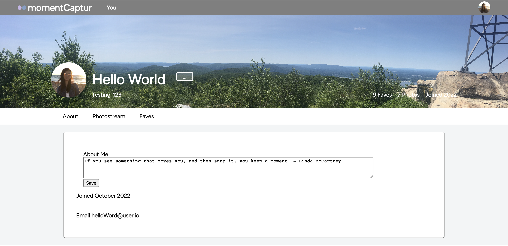

Background

Wishing to save a piece of a moment to hold on to forever and share with others? MomentCaptur is the perfect app to share all the amazing life moments you've captured. As a clone of Flicker, users can collaborate and engage with others in the MomentCaptur community that share a passion for photography. 

Functionality & MVPs

New User and User Login
    Anyone who wants to join the MomentCaptur community can sign up for a free account and login to start sharing.

User profile
    Each user has their own profile and can also view other's profiles. Each profile has an about section, a photostream section, and a faves section. The about section can be updated by the user and can be any description the user chooses to describe themselves, posts, or their account. The photostream section shows the photo posts uploaded by the user and the faves section displays the photo posts they've liked.

 

 Users can also edit their own name and username as well as change their cover photo and profile picture in the settings page.

 

Photo Posts
    The homepage is the photo posts index which shows all the posts. Each photo post item component has the username of the user who posted it, when it was created, the post photo, the post title, and the post description. In addition, the homepage also has a form to create a new photo post. Once a user uploads a picture, there is a preview and the picture will be associated with the current user as the poster.

 

    When a specific photo from a photo post in the homepage is clicked, it leads to a post show page. In the post show page, it displays the photo, the poster username, the post title, and post description. If the current user signed in is the same as the post poster, a edit post form and a delete post button is shown. The edit post form can be used to update the post title and/or post description and the delete button deletes the entire post.  

Future Features
- comments
- faves
